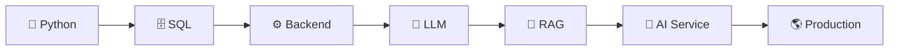

## Hi there 👋

<!--
**qkrrud141/qkrrud141** is a ✨ _special_ ✨ repository because its `README.md` (this file) appears on your GitHub profile.

Here are some ideas to get you started:

- 🔭 I’m currently working on ...
- 🌱 I’m currently learning ...
- 👯 I’m looking to collaborate on ...
- 🤔 I’m looking for help with ...
- 💬 Ask me about ...
- 📫 How to reach me: ...
- 😄 Pronouns: ...
- ⚡ Fun fact: ...
-->
<div align="center">


<br/>


</div>

---

## ⚡ SYSTEM.INIT()

```python id="dcag1v"
class Developer:

    def __init__(self):
        self.name = "Kyunghwan Park"
        self.github = "qkrrud141"
        self.role = "AI Service Developer"

        self.skills = [
            "Python",
            "SQL",
            "LLM",
            "RAG",
            "Git"
        ]

        self.interests = [
            "AI Service",
            "Automation",
            "Backend",
            "Data"
        ]

        self.status = "Building..."

    def dream(self):
        return "Turn ideas into real AI products 🚀"
```

<div align="center">

### `> INITIALIZING DEVELOPER...`

### `> LOADING AI SKILLS...`

### `> BUILDING PROJECTS...`

### `> SYSTEM READY ██████████ 100%`

</div>

---

# ⚡ TECH ARSENAL

<div align="center">

### Languages


<br/><br/>

### Development


<br/><br/>

### AI / LLM


</div>

---

# 🚀 PROJECT UNIVERSE

<table>
<tr>

<td width="50%">

<h3 align="center">📚 AI Knowledge Search</h3>

<div align="center">

`RAG` `LLM` `Python`

</div>

<br/>

업무·기술 매뉴얼을 AI가 이해하고  
사용자의 질문에 필요한 정보를 검색하는  
**RAG 기반 AI 지식 검색 서비스**

<br/><br/>

**CORE**

→ Document Processing  
→ Vector Search  
→ RAG Pipeline  
→ AI Answer Generation

</td>

<td width="50%">

<h3 align="center">📦 AI WMS</h3>

<div align="center">

`Python` `SQL` `LLM`

</div>

<br/>

AI와 물류 데이터를 연결하여  
자연어로 재고·주문·배송 정보를 관리하는  
**AI Warehouse Management System**

<br/><br/>

**CORE**

→ Inventory Search  
→ Delivery Analysis  
→ Function Calling  
→ AI Report Generation

</td>

</tr>

<tr>

<td width="50%">

<h3 align="center">⏰ Mallang Alarm</h3>

<div align="center">

`Mobile` `AI` `Gamification`

</div>

<br/>

알람과 캐릭터 수집 시스템을 결합한  
**게임형 모바일 알람 서비스**

<br/><br/>

**CORE**

→ Alarm Mission  
→ Character Collection  
→ Grade System  
→ Pixel Character

</td>

<td width="50%">

<h3 align="center">🧪 AI LAB</h3>

<div align="center">

`Experiment` `Automation` `AI`

</div>

<br/>

새로운 AI 기술을 직접 테스트하고  
서비스로 구현하는 개인 AI 연구 공간

<br/><br/>

**CURRENT**

→ AI Agents  
→ Automation  
→ LLM Application  
→ RAG Experiments

</td>

</tr>
</table>

---

# 🧠 CURRENT TRAINING

<div align="center">


</div>

```text id="g9juy3"
CURRENT LEVEL

Python          ███████░░░
SQL             ██████░░░░
Git / GitHub    █████░░░░░
LLM             █████░░░░░
RAG             ████░░░░░░

        LEVELING UP...
              ↓
       AI DEVELOPER 🚀
```

---

# 🗺 DEVELOPER ROADMAP



---

# 📊 LIVE SYSTEM STATS

<div align="center">


</div>

<br/>

<div align="center">


</div>

---

# 📡 ACTIVITY SIGNAL

<div align="center">


</div>

---

# 🐍 CONTRIBUTION SNAKE

<div align="center">


</div>

---

# 🎯 MAIN QUEST

```text id="bkqwlh"
┌─────────────────────────────────────────────┐
│                                             │
│           KYUNGHWAN'S MAIN QUEST            │
│                                             │
│   [✓] Python Fundamentals                   │
│   [✓] SQL Fundamentals                      │
│   [>] Git & GitHub                          │
│   [>] Build AI Applications                 │
│   [>] RAG                                   │
│   [ ] Backend Development                   │
│   [ ] Production AI                         │
│   [ ] AI Service Developer                  │
│                                             │
│          QUEST IN PROGRESS...               │
│                                             │
└─────────────────────────────────────────────┘
```

---

# 🧬 DEVELOPMENT LOOP

<div align="center">


</div>

---

<div align="center">


<br/>

### `> USER: qkrrud141`

### `> STATUS: BUILDING THE FUTURE...`

<br/>


</div>